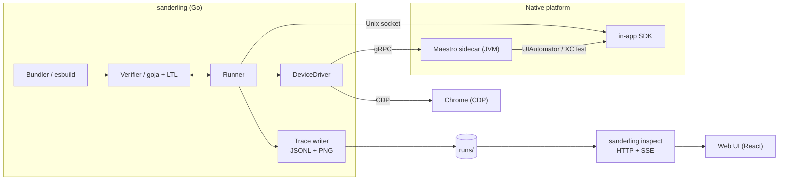

# Architecture



## Processes

**sanderling (Go).** The top-level binary. Bundles the spec with esbuild, evaluates it in goja, runs the main loop, dispatches actions through the `DeviceDriver` interface, writes the trace.

**Maestro sidecar (JVM).** A Kotlin process that wraps `maestro-client` and exposes a gRPC surface matching the `DeviceDriver` interface. Handles UI input, screenshots, the system accessibility tree, and OS-level alerts. Native platforms only.

**In-app SDK.** A Kotlin (or Swift for iOS) library linked into the app under test. Exposes a Unix socket to the runner. Provides pause and resume, view-hierarchy dumps, coverage reads, log capture, and user-registered state extractors. Native platforms only.

**Chrome (CDP).** For web targets, the Go binary drives Chrome directly over the Chrome DevTools Protocol. No sidecar or in-app SDK is involved.

## Transports

| Channel | Platform | Transport | Purpose |
|---|---|---|---|
| Go to Maestro sidecar | Native | gRPC (localhost TCP) | UI input, screenshots, system alerts |
| Go to in-app SDK | Native | Unix domain socket | Pause / resume, hierarchy, coverage, logs, extractors |
| Go to Chrome | Web | Chrome DevTools Protocol | UI input, screenshots, DOM hierarchy, console logs |

On native, the transport split exists because only real UI events need to cross process and OS-API boundaries. Introspection is cheap, frequent, and lives on a fast local socket directly to the app. On web, CDP handles both.

## Inspect UI

`sanderling inspect` is a separate mode of the same Go binary. It serves an embedded React bundle and reads `runs/` from disk, streaming file-watcher events over SSE so the UI updates as new steps land. It has no connection to any driver; it only consumes the trace artifacts.

## Per-step cycle

The heart of the system is:

```
pause  ─►  capture state  ─►  evaluate properties  ─►  pick action  ─►  resume  ─►  dispatch
```

**Native (Android / iOS):**

1. The runner asks the driver to wait until the UI is idle.
2. The runner sends `PAUSE` to the SDK over the Unix socket. The SDK freezes the main runloop at a safe point.
3. The SDK sends back a `STATE` message: view hierarchy, coverage delta, logs since last step, exception list, snapshot values.
4. The runner feeds state into goja. Extractors re-read; properties re-evaluate; the action generator returns a weighted tree.
5. The runner writes the trace entry for this step.
6. The runner picks an action by weight.
7. The runner sends `RESUME` to the SDK, then dispatches the action through the driver (gRPC to sidecar → Maestro → UIAutomator or XCTest).
8. Loop.

**Web (Chrome):**

Steps 2-3 use CDP to capture the DOM hierarchy and console logs directly; there is no SDK pause/resume. The rest of the cycle is identical.

The cycle runs hundreds of times per minute. Every step produces one row in `trace.jsonl` and one screenshot.

