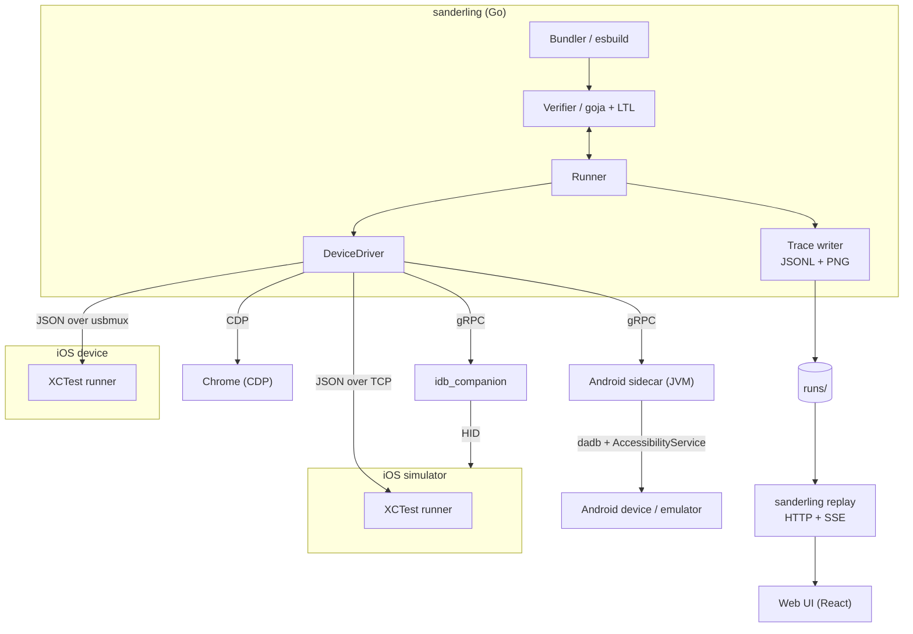

# Architecture


```mermaid
flowchart TB
    subgraph go["sanderling (Go)"]
        direction LR
        B["Bundler / esbuild"] --> V["Verifier / goja + LTL"]
        V <--> R["Runner"]
        R --> D["DeviceDriver"]
        R --> T["Trace writer\nJSONL + PNG"]
    end

    SC["Android sidecar (JVM)"]
    AD["Android device / emulator"]
    IC["idb_companion"]
    subgraph sim["iOS simulator"]
        SR["XCTest runner"]
    end
    subgraph dev["iOS device"]
        DR["XCTest runner"]
    end
    CH["Chrome (CDP)"]
    RD[("runs/")]
    IN["sanderling replay\nHTTP + SSE"]
    UI["Web UI (React)"]

    D -->|gRPC| SC
    SC -->|"dadb + AccessibilityService"| AD
    D -->|gRPC| IC
    IC -->|HID| sim
    D -->|"JSON over TCP"| SR
    D -->|"JSON over usbmux"| DR
    D -->|CDP| CH

    T --> RD --> IN --> UI
```

## Processes

**sanderling (Go).** The top-level binary. Bundles the spec with esbuild, evaluates it in goja, runs the main loop, dispatches actions through the `DeviceDriver` interface, writes the trace.

**Android sidecar (JVM).** A Kotlin process that exposes a gRPC surface matching the `DeviceDriver` interface. Handles UI input, screenshots, and the system accessibility tree. Android only, emulator and USB device alike: it drives the device with Maestro's `AndroidDriver` over dadb and reads the hierarchy from an on-device AccessibilityService.

**iOS runner (Swift XCTest).** No JVM is involved on iOS. A purpose-built XCTest runner running inside the simulator or on the device serves accessibility snapshots, text input and app lifecycle. On the simulator a vendored idb_companion child process supplies HID gestures, screenshots and screen geometry alongside it; on a physical device the runner serves those too and idb_companion is not used.

**Chrome (CDP).** For web targets, the Go binary drives Chrome directly over the Chrome DevTools Protocol. No sidecar is involved.

## Transports

| Channel | Platform | Transport | Purpose |
|---|---|---|---|
| Go to Android sidecar | Android | gRPC (localhost TCP) | UI input, screenshots, hierarchy |
| Go to idb_companion | iOS simulator | gRPC (localhost TCP) | HID gestures, screenshots, screen geometry |
| Go to XCTest runner | iOS simulator | newline-delimited JSON (loopback TCP) | accessibility snapshots, text input, app lifecycle |
| Go to XCTest runner | iOS device | newline-delimited JSON (in-process usbmux forwarder) | the whole driver surface, with no idb_companion |
| Go to Chrome | Web | Chrome DevTools Protocol | UI input, screenshots, DOM hierarchy, console logs |

Nothing is linked into the app under test on any platform, and the iOS simulator is the only target whose driver splits across two channels. On web, extractors and the action picker run in V8 inside the page, so only coordinates and values cross back to Go; LTL always evaluates host-side in goja.

## Replay UI

`sanderling replay` is a separate mode of the same Go binary. It serves an embedded React bundle and reads `runs/` from disk, streaming file-watcher events over SSE so the UI updates as new steps land. It has no connection to any driver; it only consumes the trace artifacts.

## Per-step cycle

The heart of the system is:

```
fetch state  ─►  evaluate properties  ─►  pick action  ─►  dispatch
```

**Native (Android / iOS):**

1. The runner asks the driver to wait until the UI is idle.
2. The runner fetches the UI hierarchy and logs from the driver.
3. The runner feeds state into goja. Extractors re-read; properties re-evaluate; the action generator returns a weighted tree.
4. The runner writes the trace entry for this step.
5. The runner picks an action by weight and dispatches it through the driver (gRPC to the sidecar on Android, HID and the XCTest runner on iOS).
6. Loop.

**Web (Chrome):**

CDP captures the DOM hierarchy and console logs directly. The rest of the cycle is identical.

The cycle runs hundreds of times per minute. Every step produces one row in `trace.jsonl` and one screenshot.

