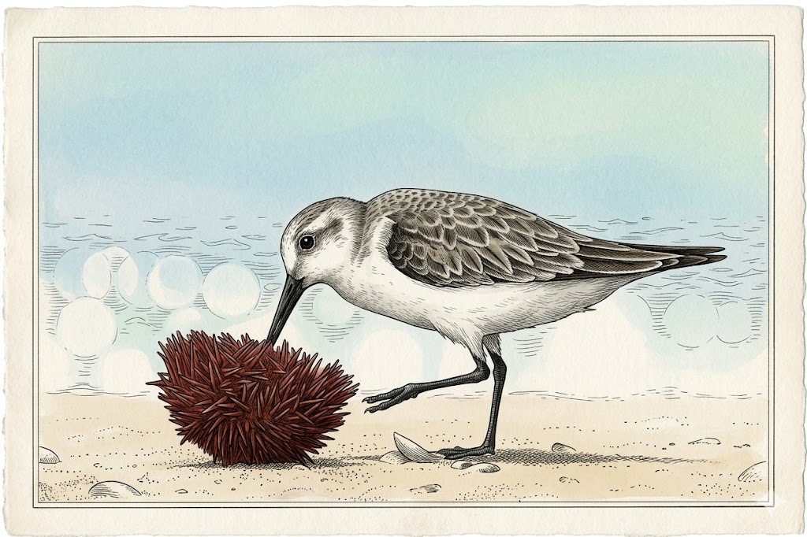

# Sanderling Manual

Autonomous property-based testing for mobile/web apps. Specs in TypeScript. Core in Go. Drives the app under test through UIAutomation/XCTest and an in-app SDK on Android/iOS and CDP on web.

Alpha: Scope of v0.1.0 is tracked in [issue #4](https://github.com/priyanshujain/sanderling/issues/4).

- [Getting started](./manual/getting-started.html)
- [Writing specs](./manual/writing-specs.html)
- [Runs](./manual/runs.html)
- [Inspect](./manual/inspect.html)
- [CLI reference](./manual/cli.html)

---

> sanderling, a wading bird that probes the shoreline for bugs that lie beneath.
